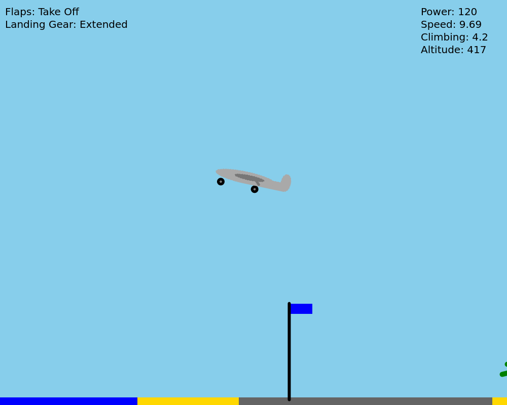
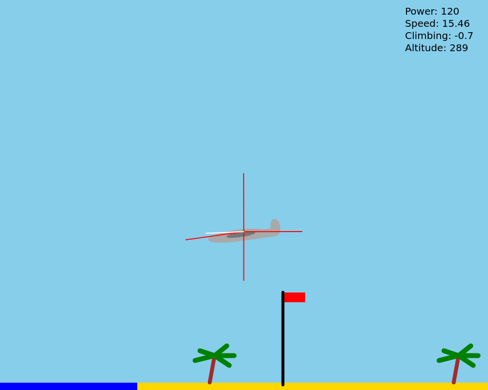

# Planes_2025
'Planes' is one of my first projects created in p5.js library to learn Object-Oriented Programming in JavaScript.

## Instruction
- To play 'Planes', open the file _index.html_ in your browser.
- Controls:
    - arrows up and down - altitude (small changes);
    - arrows left and right - altitude (big changes);
    - 2 - full throttle;
    - W - throttle up;
    - S - throttle down;
    - X - turn off throttle;
    - F - flaps;
    - G - landing gear;
    - V - show vectors.

## Last changes:
v1.1 - 2025.02.13
* Added air density and new clouds;

v1.0 - 2025.02.11
* Changed game format to full screen;
* Added sky animation.

  
   
  

